<!-- ASCII_PORTRAIT_START -->

<!-- ASCII_PORTRAIT_END -->

<samp>
<a href="https://www.linkedin.com/in/aditi-patil-888560414">linkedin</a> &nbsp;·&nbsp;
<a href="https://github.com/aditi22builds">github</a>
</samp>

 

> Second-Year B.Tech Student in Computer Science & Engineering (Data Science). 
> Exploring AI, ML, and Data Science through hands-on projects and open source.

I focus on building practical tools, understanding core machine learning fundamentals, 
and shipping code in public. Constantly experimenting with Python, algorithms, and data.

<samp>python &nbsp; java &nbsp; c &nbsp; c++ &nbsp; data-science &nbsp; machine-learning &nbsp; git &nbsp; github &nbsp; vs-code</samp>

**[python-quiz-game](https://github.com/aditi22builds/python-quiz-game)** &nbsp;·&nbsp; <samp>python</samp> 
Command-line interactive quiz engine featuring progressive difficulty tiers, 
dynamic scoring algorithms, and persistent leaderboard tracking.

**[kyntra](https://github.com/aditi22builds/kyntra)** &nbsp;·&nbsp; <samp>typescript</samp> 
Modern full-stack web project exploring component architecture and typed workflows.

**[pinchbooth](https://github.com/aditi22builds/pinchbooth)** &nbsp;·&nbsp; <samp>html, css, javascript</samp> 
Interactive camera booth application with real-time UI interaction in the browser.

**[My-Portfolio](https://github.com/aditi22builds/My-Portfolio)** &nbsp;·&nbsp; <samp>javascript, html, css</samp> 
Personal developer portfolio showcasing builds, technical skills, and background.

**[my_python_projects.](https://github.com/aditi22builds/my_python_projects.)** &nbsp;·&nbsp; <samp>python</samp> 
Curated collection of algorithms, problem-solving scripts, and mini-tools.

<samp>
[linkedin] <a href="https://www.linkedin.com/in/aditi-patil-888560414">linkedin.com/in/aditi-patil-888560414</a> 
[github] &nbsp;&nbsp;<a href="https://github.com/aditi22builds">github.com/aditi22builds</a>
</samp>

Every visual component on this profile is self-rendered without external third-party widgets. 
`ascii.svg` is an animated SMIL portrait generated from a source photo by 
[`scripts/make_portrait.py`](scripts/make_portrait.py), inlining the SIL OFL 
[JetBrains Mono](scripts/fonts) typeface to lock character advance width across platforms.

Contribution metrics and section headings are drawn as pure vector graphics by 
[`scripts/generate_stats.py`](scripts/generate_stats.py) and refreshed automatically via 
[GitHub Actions](.github/workflows/stats.yml).

---

<samp>© 2026 Aditi Patil · Keep learning. Keep building.</samp>

